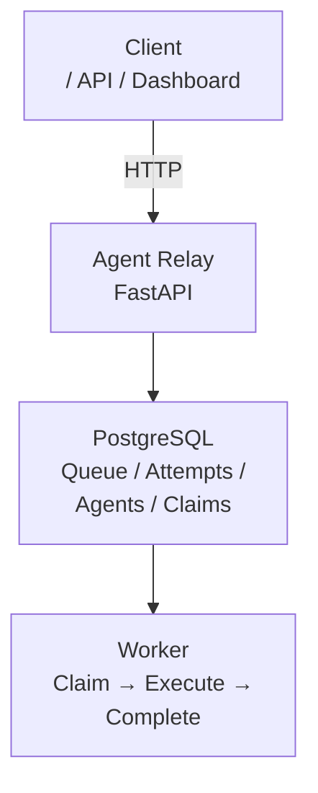
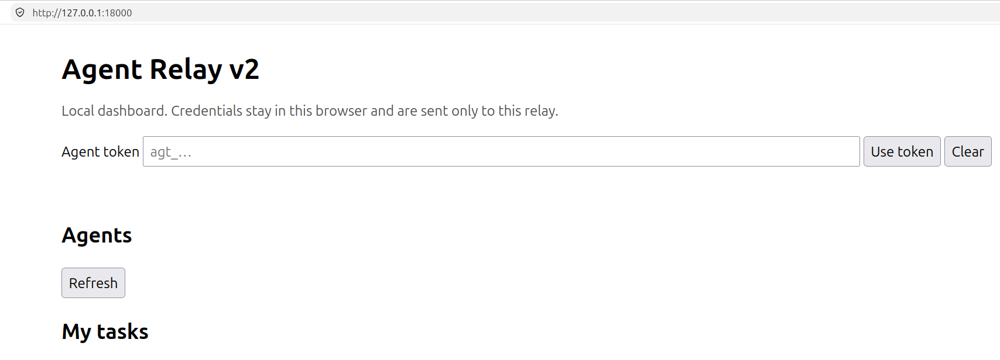
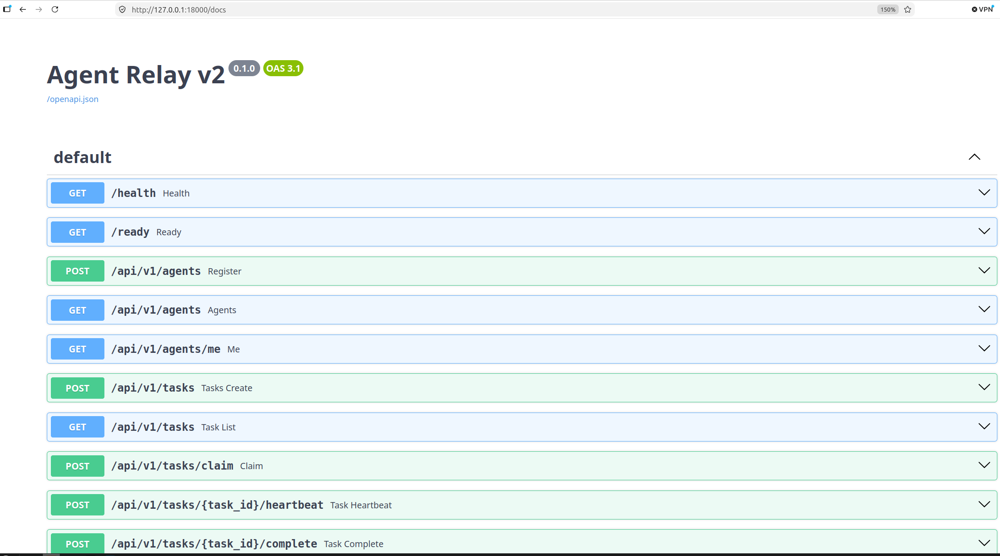

# Agent Relay

Agent Relay is a small FastAPI service for registering agents, delivering tasks, and recording task results.

The project started as a self-contained SQLite implementation and was extended through Homework Questions 1–6 into a containerized and Kubernetes-deployed service with PostgreSQL persistence, automated tests, Docker image builds, and CI/CD deployment to a local Kind cluster.

## Architecture

The core lifecycle is:



For the original local starter, SQLite remains supported.

For the containerized deployment, PostgreSQL is used as the persistent database.

## Main components

* **FastAPI** — HTTP API and dashboard
* **PostgreSQL** — persistent task, agent, claim, and attempt state
* **Worker** — claims and executes tasks
* **Docker** — application containerization
* **GitHub Actions** — automated testing and deployment workflow
* **Kubernetes / Kind** — local Kubernetes deployment

Important source files include:

```text
main.py          FastAPI routes and application entrypoint
database.py      SQLAlchemy models and database configuration
storage.py       Task, claim, recovery, and persistence operations
schemas.py       API request/response models
worker.py        Worker implementation
tests/           Automated test suite
k8s/             Kubernetes manifests
.github/
└── workflows/
    └── ci-cd.yml   CI/CD workflow
```

---

## 1. Local Development

The application can be run locally with SQLite without Docker or Kubernetes.

```bash
uv sync
uv run uvicorn main:app --reload
```

Open:

```text
http://127.0.0.1:8000/
```

The default database is:

```text
./agent-relay.db
```

A different SQLite database can be configured with:

```bash
export RELAY_DATABASE_URL=sqlite:///./agent-relay.db
```

### Health and readiness

Liveness:

```bash
curl http://127.0.0.1:8000/health
```

Readiness:

```bash
curl http://127.0.0.1:8000/ready
```

`/health` verifies that the application process is alive.

`/ready` verifies actual database connectivity and schema availability. This prevents an application with an empty or missing database schema from incorrectly reporting itself as ready.

---

## 2. Agent Registration and Task Delivery

Agents are registered through the API.

Example:

```bash
alice=$(curl -sS -X POST http://127.0.0.1:8000/api/v1/agents \
  -H 'content-type: application/json' \
  -d '{"name":"alice"}')

uppercase=$(curl -sS -X POST http://127.0.0.1:8000/api/v1/agents \
  -H 'content-type: application/json' \
  -d '{"name":"uppercase"}')
```

Registration returns an agent token once.

The token must be kept outside source control.

Subsequent authenticated requests use:

```text
Authorization: Bearer <token>
```

For shared installations, registration can additionally be protected with:

```text
RELAY_ENROLLMENT_SECRET
```

and:

```text
X-Enrollment-Secret: <secret>
```

---

## 3. Worker

The included deterministic worker transforms the task input using:

```python
input.upper()
```

Example:

```bash
uv run python main.py worker \
  --base-url http://127.0.0.1:8000 \
  --name uppercase \
  --credentials ./uppercase-credentials.json \
  --worker-id laptop-1
```

An existing credential can also be supplied explicitly:

```bash
uv run python main.py worker \
  --agent-id agent_123 \
  --token agt_… \
  --worker-id laptop-2
```

Worker credentials stored in a JSON file use restrictive file permissions (`0600`).

---

## 4. Delivery Semantics

Agent Relay uses **at-least-once task delivery**.

A task is claimed with a lease. The default lease duration is:

```text
60 seconds
```

Workers send heartbeats while processing long-running tasks.

If a worker disappears before completing its task, the claim eventually expires and another worker can recover the task.

The server supports configurable values:

```text
RELAY_LEASE_SECONDS
RELAY_MAX_ATTEMPTS
```

A terminal completion or failure requires both:

1. the recipient's bearer token
2. the claim token

Terminal requests are idempotent when the exact same claim token and result are repeated.

A stale claim token or a different result for an already-terminal claim returns:

```text
409 Conflict
```

---

## 5. PostgreSQL

The original implementation uses SQLite because SQLite is useful for a self-contained local starter.

During the homework, the persistence layer was extended to run with PostgreSQL in the containerized deployment.

The application receives database configuration through environment variables rather than hard-coding credentials.

The Kubernetes deployment uses a PostgreSQL `Secret` for database credentials and a persistent volume for PostgreSQL storage.

The resulting deployment contains:

```text
PostgreSQL Deployment
PostgreSQL Service
PostgreSQL Secret
PostgreSQL PVC
```

This keeps database credentials out of the application image and allows PostgreSQL data to survive container restarts.

---

## 6. Docker

Agent Relay is containerized using a Dockerfile.

Build the image:

```bash
docker build -t agent-relay:local .
```

The resulting local image was successfully built as:

```text
agent-relay:local
```

with an image size of approximately:

```text
361 MB
```

Run the application:

```bash
docker run --rm \
  -p 8000:8000 \
  agent-relay:local
```

The container exposes:

```text
8000
```

The application can then be checked with:

```bash
curl http://127.0.0.1:8000/health
```

Docker provides the same application artifact that is later loaded into the Kind Kubernetes cluster.

---

## 7. Automated Tests

The project includes tests covering the main Agent Relay protocol and lifecycle.

Run the test suite:

```bash
uv run pytest -q
```

The local test suite was successfully executed with:

```text
5 passed
```

The tests cover important behavior including:

* agent authentication
* sender/recipient access boundaries
* task claiming
* claim-token hashing
* idempotent terminal requests
* concurrent claims
* lease expiration
* task recovery
* pagination and API error shapes
* dashboard asset serving

The test environment uses a scratch database so normal development data is not accidentally reset.

---

## 8. Successful Task Execution

The deterministic worker was successfully verified end-to-end.

Example successful task:

```text
Task:
hello agent relay
```

Worker result:

```text
HELLO AGENT RELAY
```

The task reached:

```text
status: completed
```

with:

```text
attempt_count: 2
```

This also demonstrated the retry/redelivery behavior of the leased task model.

---

## 9. Kubernetes Deployment

The application was deployed to a local Kubernetes cluster using **Kind**.

The cluster context is:

```text
kind-kind
```

The deployment consists of Kubernetes resources under:

```text
k8s/
```

including:

```text
k8s/
├── agent-relay-deployment.yaml
├── agent-relay-service.yaml
├── postgres-deployment.yaml
├── postgres-service.yaml
├── postgres-secret.yaml
└── postgres-pvc.yaml
```

The exact filenames may vary with the current manifest organization, but the deployment contains the Agent Relay application and PostgreSQL resources.

### Load the local image into Kind

```bash
kind load docker-image agent-relay:local --name kind
```

Apply the Kubernetes manifests:

```bash
kubectl apply -f k8s/
```

Check the resources:

```bash
kubectl get pods
kubectl get deployments
kubectl get services
kubectl get pvc
```

Check the Agent Relay rollout:

```bash
kubectl rollout status deployment/agent-relay
```

The Kubernetes `Deployment` is responsible for maintaining the desired application replicas and managing application rollouts.

---

## 10. Kubernetes Configuration

The application container receives PostgreSQL configuration from Kubernetes.

The deployment uses Kubernetes environment-variable references such as:

```text
$(POSTGRES_USER)
```

rather than shell-style:

```text
${POSTGRES_USER}
```

This is important because Kubernetes performs environment-variable expansion using its own syntax.

Database credentials are stored in a Kubernetes `Secret`.

PostgreSQL data is backed by a `PersistentVolumeClaim`.

The architecture is therefore:

```text
Kubernetes
│
├── Agent Relay Deployment
│   └── Agent Relay container
│
├── Agent Relay Service
│
├── PostgreSQL Deployment
│   └── PostgreSQL container
│
├── PostgreSQL Service
│
├── PostgreSQL Secret
│
└── PostgreSQL PVC
```

---

## 11. Accessing the Kubernetes Deployment

The application can be accessed locally through Kubernetes port forwarding:

```bash
kubectl port-forward service/agent-relay 18000:8000
```

Then verify:

```bash
curl http://127.0.0.1:18000/health
```

The dashboard is available at:

```text
http://127.0.0.1:18000/
```



The Kubernetes deployment was successfully verified by accessing the dashboard through the port-forwarded service.

The deployed dashboard also verifies the application version:

```text
Agent Relay v2
```

---

## 12. CI/CD

GitHub Actions automates the verification and deployment workflow.

The workflow is located at:

.github/workflows/ci-cd.yml

The deployment pipeline follows this sequence:
```
Push / Workflow Trigger
        │
        ▼
   Run Tests
        │
        │ success
        ▼
 Build Docker Image
        │
        ▼
 Tag Image with Git SHA
        │
        ▼
 Ensure Kind Cluster
 (create if missing or
  stopped; reuse if
  already running)
        │
        ▼
 Export Kubeconfig
        │
        ▼
 Load Image into Kind
        │
        ▼
 Apply Kubernetes Manifests
        │
        ▼
 Update Deployment Image
        │
        ▼
 Wait for Rollout
        │
        ▼
 Port Forward (18000 → 8000)
        │
        ▼
 Verify Dashboard
```

The Docker image uses the unique Git commit SHA as its deployment tag:

IMAGE_TAG: ${{ github.sha }}

This provides an immutable relationship between a deployed image and the Git commit that produced it.

The Docker build is also gated by the test job:

test
  ↓
build/deploy

Therefore, a failed test prevents the deployment stage from proceeding.

Kind cluster lifecycle:
The build-and-deploy job no longer assumes a Kind cluster already exists. It checks for a cluster named kind:

If none exists, it creates one.
If one is registered but its control-plane container is not actually running (e.g. stopped between runs), it deletes and recreates the cluster to avoid inconsistent state.
If one exists and is running, it reuses it as-is — no rebuild needed.

Immediately after, the workflow explicitly runs kind export kubeconfig so kubectl in the job's execution context always points to the correct, current cluster — regardless of whether the cluster was just created or reused from a previous run.

Dashboard verification port:
The verification step forwards the Kubernetes Service's port 8000 to local port 18000 (rather than 8000:8000) to avoid colliding with unrelated local services that may already occupy port 8000 on the host running the pipeline.

---

## 13. CI/CD Deployment Verification

The CI/CD workflow verifies the Kubernetes deployment after updating the application image.

The deployment process includes:

```bash
kubectl apply -f k8s/
```

followed by updating the deployment image and waiting for the rollout to complete.

The workflow then accesses the application through Kubernetes port forwarding and verifies that the dashboard contains:

```text
Agent Relay v2
```

This provides an application-level deployment check rather than only checking whether the Kubernetes Pod is running.

---

## 14. Failure and Recovery

The system supports leased task claims so that work is not permanently lost when a worker disappears.

For example:

```bash
uv run python main.py worker \
  --credentials ./uppercase-credentials.json \
  --slow-seconds 75 \
  --worker-id slow-laptop
```

The worker heartbeats during execution.

If the worker is terminated, its claim remains leased until the lease expires.

After the lease expires, another worker can claim the task.

The new claim receives a new claim token and the attempt count is incremented.

This gives the relay an explicit recovery mechanism while retaining at-least-once delivery semantics.

---

## 15. Project Evolution

The project evolved through the six homework questions from a local protocol implementation into a deployable service.

```text
Q1
│
├── Understand Agent Relay architecture
├── Agents
├── Tasks
├── Claims
└── Results
        │
        ▼
Q2
│
├── Verify task lifecycle
├── Worker execution
└── Automated tests
        │
        ▼
Q3
│
├── Docker image
├── Containerized FastAPI
└── Health verification
        │
        ▼
Q4
│
├── PostgreSQL
├── Persistent database
└── Containerized application stack
        │
        ▼
Q5
│
├── Kubernetes manifests
├── Kind cluster
├── Agent Relay Deployment
├── PostgreSQL Deployment
└── Persistent storage
        │
        ▼
Q6
│
├── GitHub Actions
├── Test-gated Docker build
├── SHA-based image tags
├── Kind deployment
├── Rollout verification
└── Dashboard verification
```

The final result is a complete development-to-deployment workflow:

```text
Code
  ↓
Tests
  ↓
Docker
  ↓
Git SHA Image
  ↓
Kind
  ↓
Kubernetes
  ↓
PostgreSQL
  ↓
Agent Relay
  ↓
Dashboard / API
```

---

## 16. Repository Structure

A simplified repository structure is:

```text
agent-relay/
├── .github/
│   └── workflows/
│       └── ci-cd.yml
│
├── k8s/
│   ├── agent-relay-deployment.yaml
│   ├── agent-relay-service.yaml
│   ├── postgres-deployment.yaml
│   ├── postgres-service.yaml
│   ├── postgres-secret.yaml
│   └── postgres-pvc.yaml
│
├── main.py
├── database.py
├── storage.py
├── schemas.py
├── worker.py
├── Dockerfile
├── pyproject.toml
├── uv.lock
└── README.md
```

---

## 17. Quick Verification

### Local

```bash
uv sync
uv run pytest -q
uv run uvicorn main:app --reload
```

Verify:

```bash
curl http://127.0.0.1:8000/health
curl http://127.0.0.1:8000/ready
```

### Docker

```bash
docker build -t agent-relay:local .

docker run --rm \
  -p 8000:8000 \
  agent-relay:local
```

### Kubernetes

```bash
kind load docker-image agent-relay:local --name kind

kubectl apply -f k8s/

kubectl get pods
kubectl get services
kubectl get pvc

kubectl rollout status deployment/agent-relay

kubectl port-forward service/agent-relay 18000:8000
```

Then:

```bash
curl http://127.0.0.1:18000/health
```

and open:

```text
http://127.0.0.1:18000/
```

---

## 18. Design Notes

The original SQLite implementation intentionally keeps the storage layer isolated from the HTTP protocol.

SQLite uses an explicit `BEGIN IMMEDIATE` transaction strategy because SQLite does not provide PostgreSQL's:

```sql
FOR UPDATE SKIP LOCKED
```

The storage abstraction makes it possible to move the persistence implementation to PostgreSQL without changing the core HTTP lifecycle.

The project therefore separates:

```text
HTTP/API
   │
   ▼
Storage interface / operations
   │
   ├── SQLite
   │
   └── PostgreSQL
```

This separation is useful for keeping the Agent Relay protocol independent from the database implementation.

---

## 19. Current Status

The Agent Relay homework implementation has successfully demonstrated:

* [x] Agent registration and authentication
* [x] Task creation and delivery
* [x] Worker execution
* [x] At-least-once delivery
* [x] Lease and heartbeat handling
* [x] Task recovery after lease expiration
* [x] Idempotent terminal requests
* [x] Automated tests
* [x] PostgreSQL persistence
* [x] Docker containerization
* [x] Docker health verification
* [x] Kubernetes manifests
* [x] Kind deployment
* [x] PostgreSQL on Kubernetes
* [x] Persistent PostgreSQL storage
* [x] Kubernetes rollout verification
* [x] Dashboard verification
* [x] GitHub Actions CI/CD
* [x] Test-gated deployment
* [x] Git SHA-based Docker image tagging
* [x] End-to-end deployment verification

The final architecture demonstrates the complete path from application code to a running Kubernetes service:

```text
Developer
   │
   ▼
Git Repository
   │
   ▼
GitHub Actions
   │
   ├── pytest
   │
   ├── Docker build
   │
   └── Kubernetes deployment
            │
            ▼
        Kind Cluster
            │
       ┌────┴────┐
       ▼         ▼
 Agent Relay  PostgreSQL
       │
       ▼
    Dashboard
```

This repository now serves as both the Agent Relay implementation and a practical demonstration of testing, containerization, database persistence, Kubernetes deployment, and CI/CD automation.
